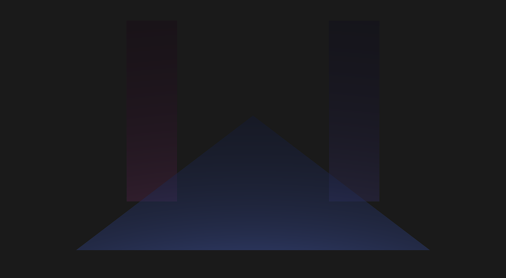
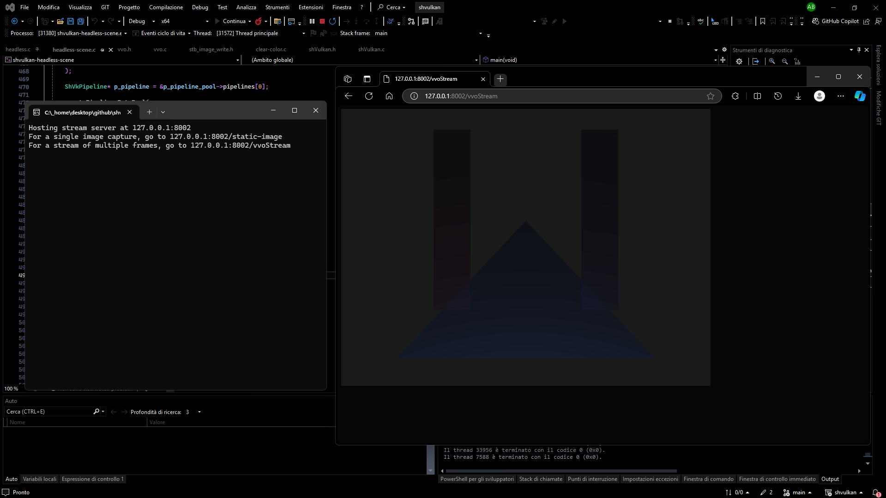
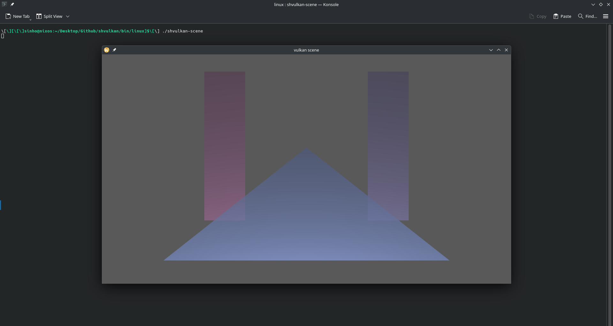

# shvulkan


[](https://github.com/mrsinho/shvulkan)


[](https://github.com/MrSinho/shvulkan/actions)


[](https://mrsinho.github.io/shvulkan-docs/index.html)


[TOC]

## Todo

- add `package/lib/pkgconfig/shvulkan.pc` file for `pkg-config`

`shvulkan` is a lightweight and flexible wrapper around the Vulkan® API written completely in C, that makes it easier to work with graphics efficiently without writing thousands of lines of code.



__Scene example__: *alfa blending, instancing and indexed draw calls example.*


__Headless scene example using [vulkan-virtual-outputs](https://github.com/mrsinho/vulkan-virtual-outputs)__: *alfa blending, instancing and indexed draw calls also here, but the images are streamed in an http server.*

---

## Build status 

[](https://github.com/MrSinho/shvulkan/actions) 


The examples are frequently being tested on **Windows 11**, **NixOS** (with Nix flake), **Linux Mint** (virtual machine and pc) with different compilers (**MSVC**, **gcc**), hardware configurations (RX580 4GB GDDR5, Radeon V Carrizo 500MB) and windowing systems (**Win32**, **X11**, **Wayland**).

## Features

- Main Vulkan API calls wrapped through more straightforward functions
- C/C++ build systems
  - `CMake` support (see the classic [CMake build chapter](#embed-shvulkan-with-your-cc-projects-classic-way))
  - `Nix` + `CMake` support (see the [Nix build systems chapter](#nix-build-systems))
- [Examples](#examples)
  - Minimal clear color example
  - Scene example with indexed draw calls
  - Compute examples

## CMake targets and variables

| CMake Target                   | Type            | Configure Flags             |
|--------------------------------|-----------------|-----------------------------|
| shvulkan                       | library         | /                           |
| shvulkan-docs                  | Doxygen outputs | SH_VULKAN_BUILD_DOCS=ON     |
| shvulkan-clear-color           | executable      | SH_VULKAN_BUILD_EXAMPLES=ON |
| shvulkan-scene                 | executable      | SH_VULKAN_BUILD_EXAMPLES=ON |
| shvulkan-compute-example       | executable      | SH_VULKAN_BUILD_EXAMPLES=ON |

If the cmake option `SH_VULKAN_BUILD_EXAMPLES` is enabled, the additional [`glfw`](https://github.com/glfw/glfw) target will be generated as a static library.

| CMake Variable                 | About                                                  |
|--------------------------------|--------------------------------------------------------|
| SH_VULKAN_VERSION              | Version of the `shvulkan` library                      |
| SH_VULKAN_ROOT_DIR             | Absolute path to the root of the repository directory  |
| SH_VULKAN_LIB_DIR              | Absolute path to the output library directory          |
| SH_VULKAN_BIN_DIR              | Absolute path to the output executable directory       |

---

## Clone and Build

Open the terminal and run the following commands:


Be sure to have installed the official [Vulkan® SDK](https://www.lunarg.com/vulkan-sdk/) from LunarG, then run the following commands:

```bash
git clone --recursive https://github.com/mrsinho/shvulkan.git
cd shvulkan
mkdir build
cd build
cmake -DSH_VULKAN_BUILD_EXAMPLES=ON ..
cmake --build .

cd bin/examples

start shvulkan-clear-color
start shvulkan-scene
start shvulkan-compute-power-numbers

```


On Debian and similar distributions before building the project you first need to install some packages:

```bash
sudo add-apt-repository -y ppa:oibaf/graphics-drivers
sudo apt update -y

sudo apt install -yy libvulkan-dev libvulkan1 vulkan-utils mesa-vulkan-drivers
sudo apt install -yy libxrandr-dev libxinerama-dev libxcursor-dev libxi-dev
```

Now run these commands to build:

```bash
git clone --recursive https://github.com/mrsinho/shvulkan.git
cd shvulkan
mkdir build
cd build
cmake -DSH_VULKAN_BUILD_EXAMPLES=ON ..
cmake --build .

cd bin/examples

./shvulkan-clear-color & ./shvulkan-scene & ./shvulkan-compute-power-numbers
```

---

---

## Embed shvulkan with your C/C++ projects (classic way)

To link to the `shvulkan` library with CMake:

```cmake
if (NOT TARGET shvulkan)

set(SH_VULKAN_ROOT_DIR     path/to/shvulkan/root/directory)
set(SH_VULKAN_BINARIES_DIR path/your/binaries/directory)

include(${SH_VULKAN_ROOT_DIR}/shvulkan/shvulkan.cmake)
build_shvulkan()

endif()

# [...]

target_link_libraries(app PUBLIC shvulkan)

```

Then, include the `shVulkan.h` header file:

```c
#include <shvulkan/shVulkan.h>
```

---

## Nix build systems


Tested on X11 and Wayland graphics servers. The Nix flake lets the system choose the default windowing system.

> [!WARNING]
> While testing with Wayland revealed no issues, there are some resizing issues when using X11.

* Build examples and docs. Nix output is `out`:
```bash
nix build .#shvulkan.out
cd result/bin/examples
./shvulkan-clear-color & ./shvulkan-scene & ./shvulkan-compute-power-numbers
```

* Build static library and generate pkgconfig file. Nix output is `dev`:
```bash
nix build .#shvulkan.dev
cd result-dev
```



### Import project as a Nix module

```nix
{ ... }:
let
  # Copy the the latest commit hash or copy the results from `nix-prefetch-git shvulkan`
  shvulkan-remote = builtins.fetchGit {
    url = "https://github.com/mrsinho/shvulkan.git";
    rev = "[...]";
  };

  shvulkan = import "${shvulkan-remote}/nix" { inherit pkgs; };
in
{
  # [...]

  environment.systemPackages = [ # or `home.packages` from home-manager 
    shvulkan
  ];

}
```

### Import project as a Nix flake

First import the `shvulkan` flake:
```nix
{
  description = "Your Nix flake"

  inputs = {

    nixpkgs = {
      url = "github:NixOS/nixpkgs/nixos-unstable";
    };

    # [...]

    shvulkan = {
      url = "github:mrsinho/shvulkan";
      inputs.nixpkgs.follows = "nixpkgs";
    };

  };

  # [...]
}
```

Then you can reference the package:
```nix
{ inputs, pkgs, ... }:

{
  # [...]
  
  environment.systemPackages = [ # Or `home.packages` for home-manager
    inputs.shvulkan.defaultPackage.${pkgs.stdenv.hostPlatform.system}
  ];

}
```

## Find shvulkan package through pkg-config

When building with Nix, a `.pc` package configuration file can be found at `result/lib/shvulkan.pc`. Once shvulkan has been added to your project, it can be easily imported by CMake.

```cmake
find_package(shvulkan REQUIRED)

add_executable(app app.c)

target_link_libraries(app PUBLIC
  shvulkan # Ok
  m        # libmath, it's often necessary for graphics
  glfw     # the go-to choice for managing window system
  X11      # required for X11 configurations
)
```

Another valid approach is through passing a CMake flag from your nix building pipeline. You can use the following Nix derivation build example for reference, see [flake.nix](./flake.nix) and [nix/pipeline.nix](./nix/pipeline.nix) for more details:

```nix
{ pkgs, ... }:

let
  shvulkan-remote = builtins.fetchGit {
    url = "https://github.com/mrsinho/shvulkan.git";
    rev = "[...]";
  };

  shvulkan = import "${shvulkan-remote}/nix" { inherit pkgs; };
in

yourProject = pkgs.stdenv.mkDerivation {
  pname = "yourProject";
  version = "1.0.0";

  src = ./;

  nativeBuildInputs = [
    pkgs.cmake
    pkgs.ninja
    pkgs.clang
    pkgs.pkg-config
  ];

  buildInputs = [
    pkgs.vulkan-tools
    pkgs.vulkan-loader
    pkgs.vulkan-helper
    pkgs.vulkan-headers
    pkgs.doxygen
  ];

  cmakeFlags = [
    # Default values passed by CMakeLists.txt
    "-DSH_VULKAN_ROOT_DIR=${shvulkan}" 
    "-DSH_VULKAN_LIB_DIR ${shvulkan}/lib"
    "-DSH_VULKAN_BIN_DIR ${shvulkan}/bin"
    "-DSH_VULKAN_DOCS_DIR ${shvulkan}/docs"
    
    # Default values passed by CMakeLists.txt
    "-DSH_VULKAN_BUILD_DOCS=OFF"
    "-DSH_VULKAN_BUILD_EXAMPLES=OFF"
  ];

  buildPhase = ''
    make -j $NIX_BUILD_CORES
  '';

  installPhase = ''
    # Copy the outputs
  '';
  
};
```

Then you can include the CMake file:

```cmake
if (NOT TARGET shvulkan)

# The SH_VULKAN_ROOT_DIR parameter has been passed by the `cmakeFlags` option before building the Nix derivation
include(${SH_VULKAN_ROOT_DIR}/shvulkan/shvulkan.cmake)

build_shvulkan()

endif()

# [...]

add_executable(app app.c)

target_link_libraries(app PUBLIC
  shvulkan # Ok
  m        # libmath, it's often necessary for graphics
  glfw     # the go-to choice for managing window system
  X11      # required for X11 configurations
)
```

## Examples

`shvulkan` ships with one [`compute example`](https://github.com/mrsinho/shvulkan/tree/main/examples/src/compute/power-numbers.c), one graphics [`clear color example`](https://github.com/mrsinho/shvulkan/tree/main/examples/src/graphics/clear-color.c), one graphics [`scene example`](https://github.com/mrsinho/shvulkan/tree/main/examples/src/graphics/scene.c) and a [`headless scene`](https://github.com/mrsinho/shvulkan/tree/main/examples/src/graphics/clear-color.c) graphics example, which instead of presenting images to the screen it streams the graphics output with an http server. 
