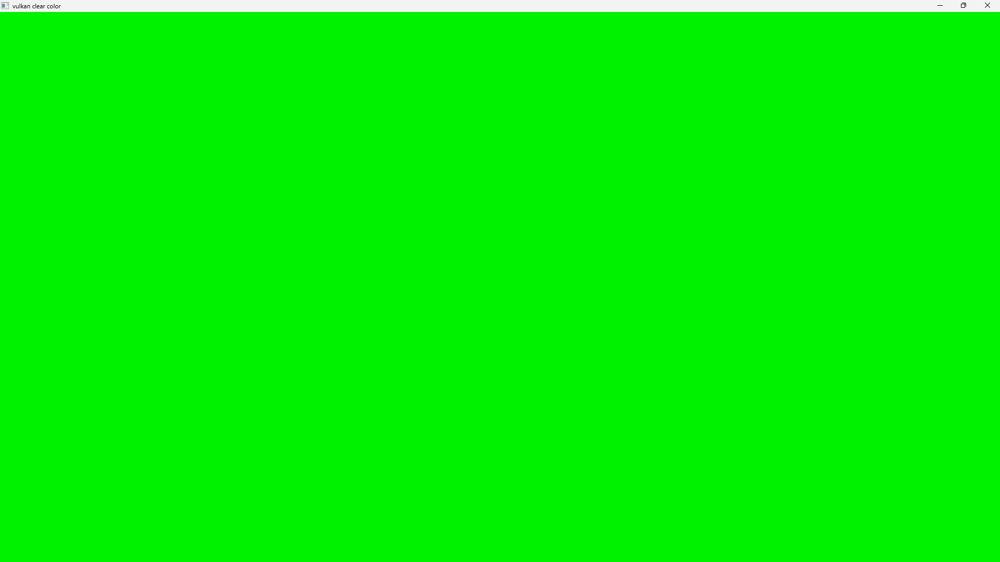

# Clear Color Example

[TOC]

Setting up a Vulkan application involves several critical steps to ensure proper configuration and resource management for rendering. [This example (`shvulkan-clear-color`)](https://github.com/MrSinho/shvulkan/blob/main/examples/src/graphics/clear-color.c) outlines the process from instance creation to frame presentation, integrating the various components and their roles.

### Instance and Surface Creation

The Vulkan setup begins with creating a Vulkan instance using the `shCreateInstance` function. This step establishes the connection between the application and the Vulkan library, specifying the application and engine names, enabling validation layers for debugging, and defining required extensions and API versions. Following the instance creation, a window surface is created via `glfwCreateWindowSurface`. This surface allows Vulkan to render content to a window, interfacing directly with the windowing system.

### Physical Device and Queue Setup

Once the instance and surface are ready, the next step is selecting a suitable physical device (GPU). This is accomplished through `shSelectPhysicalDevice`, which evaluates the GPU's capabilities to ensure it supports the necessary operations for graphics, compute, and transfer. The function retrieves important details about the device, including its properties, features, and memory attributes.

Subsequently, the `shGetPhysicalDeviceQueueFamilies` function identifies the queue families supported by the device. These queues are critical for managing rendering, presentation, compute, and transfer tasks. Based on the indices retrieved for graphics and presentation queues, device queue creation is handled by `shQueryForDeviceQueueInfo`, which sets up the appropriate VkDeviceQueueCreateInfo structures.

### Logical Device and Queues

With the queue information in hand, `shSetLogicalDevice` creates the logical device. This device acts as an abstraction layer over the physical GPU, allowing the application to submit commands and manage resources. The logical device is configured with the necessary extensions and queue information to support the application's needs. Once the logical device is created, `shGetDeviceQueues` retrieves the actual queues for graphics and presentation, ensuring that commands can be submitted and images presented as required.

### Swapchain and Command Buffers

The swapchain is created using `shCreateSwapchain`, which manages the presentation of images to the screen. This process involves specifying the format, the number of images, and the sharing mode. The swapchain is essential for rendering content and displaying it on the window surface.

To manage command execution, `shCreateCommandPool` establishes command pools for graphics and potentially presentation tasks. Command buffers are then allocated with shAllocateCommandBuffers, which are used to record rendering commands. If the graphics and presentation queue families are different, separate command pools are created; otherwise, the same pool is used for both tasks.

### Synchronization and Resources

Synchronization between command submissions and image presentation is handled by `shCreateFences`, which creates fences to signal when commands are complete. `shGetSwapchainImages` retrieves the images from the swapchain, and `shCreateImageView` creates image views for these swapchain images, defining how they are accessed during rendering.

### Renderpass and Framebuffers

The setup concludes with the creation of a renderpass and associated framebuffers. `shCombineMaxSamples` determines the maximum number of samples for anti-aliasing. `shCreateRenderpass` configures the renderpass, defining attachments, subpasses, and their layouts. Finally, `shCreateFramebuffer` creates framebuffers for each swapchain image, linking them with the renderpass to facilitate rendering to the screen.

### Main Loop Analysis

The main loop of a Vulkan application is a critical section that manages rendering and presentation. It continuously updates the window content and handles various events. Here’s a breakdown of the process:

* **Event Handling and Window Resize**.
At the start of each loop iteration, the function `glfwPollEvents` is called to process any pending events, such as user inputs or window system events. Following this, the window size is queried with `glfwGetWindowSize`. If the window is not minimized (i.e., width and height are non-zero), the loop checks if the window has been resized. If so, it invokes resizeWindow to reconfigure the swapchain, surface, and related resources to match the new dimensions. This function updates the swapchain and other resources to ensure they align with the current window size and aspect ratio. The swapchain_image_idx is reset to 0 to start using the new swapchain images.
Additionally, if the swapchain has become suboptimal (e.g., due to the window size change or other factors affecting performance), resizeWindow is called again to address these issues and restore optimal performance.

* **Synchronization and Command Buffer Management**.
Once the window is properly resized, the loop proceeds to handle synchronization and command submission. It begins by creating a semaphore (current_image_acquired_semaphore) for signaling when the image from the swapchain is acquired. `shAcquireSwapchainImage` is then called to acquire an image from the swapchain. This function also checks if the swapchain is suboptimal and updates the swapchain_image_idx to point to the acquired image.
The loop then waits for fences associated with the command buffers of the currently acquired image to ensure that previous commands have finished execution. This is achieved through `shWaitForFences`, followed by resetting the fences with `shResetFences` to prepare them for the next frame.

* **Command Recording and Rendering**.
The command buffer for the current image is started using `shBeginCommandBuffer`. Rendering commands are recorded into this command buffer, starting with clearing the framebuffer. The clear color is dynamically calculated based on the current time, creating a visually dynamic effect.
The renderpass is then initiated with `shBeginRenderpass`, specifying the clear values and the framebuffer. After recording the rendering commands, the renderpass is ended with `shEndRenderpass`, and the command buffer is finalized with `shEndCommandBuffer`.

* **Queue Submission and Presentation**.
The completed command buffer is submitted to the graphics queue using shQueueSubmit. This function specifies the command buffer, waits for the acquisition semaphore, and signals another semaphore (graphics_queue_finished_semaphores) when the command execution is complete.
After submission, the `shQueuePresentSwapchainImage` function presents the rendered image to the screen using the presentation queue. It waits for the graphics queue semaphore to ensure that rendering is completed before presenting the image.

* **Cleanup**.
Finally, the temporary semaphore (`current_image_acquired_semaphore`) is destroyed to free up resources.

