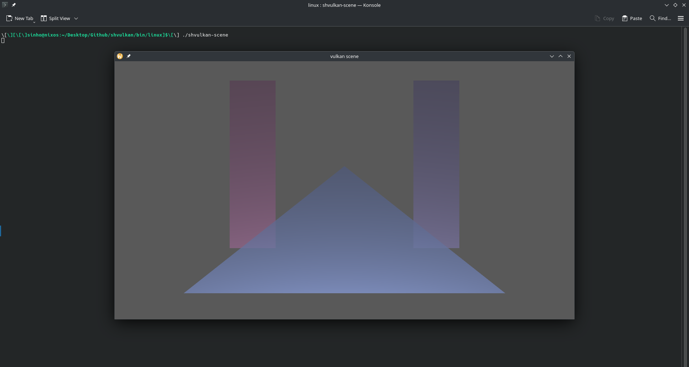
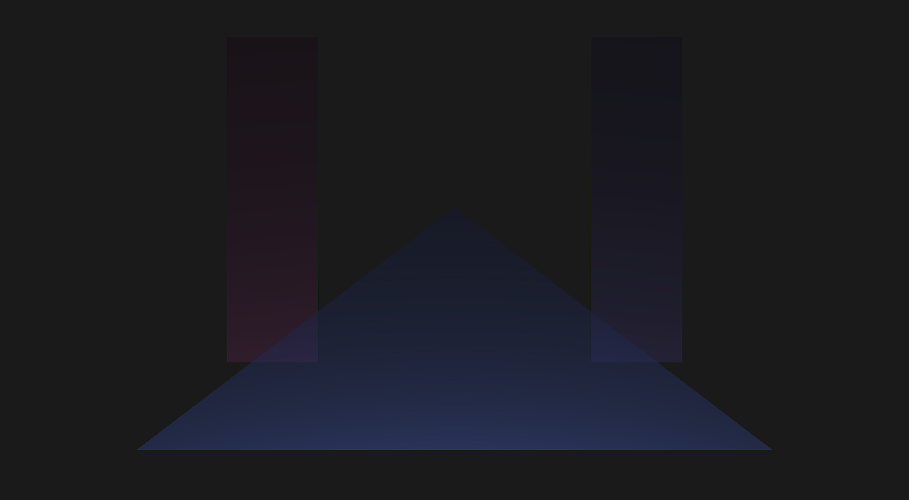

# Scene Example

[TOC]

## Scene

This more complex example starts with the definition of vertex data for two shapes: a quadrilateral and a triangle. These vertex buffers are represented by arrays of floating-point numbers, where each vertex is described by its position and texture coordinates (which are not going to be used but have been set up for demonstration). Additionally, a series of transformation matrices for instancing are defined, enabling the efficient rendering of multiple instances of the same geometry in different positions and orientations.

The setup also includes an array for indices, which specifies the order in which vertices are used to form primitives, allowing for indexed drawing of the quadrilateral. Lighting information is provided, specifying the light's position and color. The code also includes a projection-view matrix to handle transformations within the scene.

The main function initializes the GLFW library, which provides windowing and input handling. It checks for Vulkan support before creating a window and setting up the Vulkan instance, surface, physical device, and logical device. It also establishes queues for graphics and presentation operations. Swapchain creation follows, setting up the mechanism that manages frame presentation. The command buffers are allocated for both graphics and presentation tasks, and synchronization primitives such as fences and semaphores are set up to coordinate rendering.

Several Vulkan-related functions follow, aimed at managing resources and operations essential for rendering. Functions like writeMemory and releaseMemory handle memory allocation and deallocation for various buffers, including vertex, index, instance, and descriptor buffers. The createPipelinesDataPool and createPipeline functions prepare the pipeline pool and graphics pipeline configurations necessary for rendering, while resizeWindow manages window resizing, ensuring that Vulkan's swapchain and related resources are updated accordingly.

Finally, the render pass configuration is prepared, involving the setup of attachments for color and depth, along with subpass definitions, ensuring that rendering can proceed with proper blending, depth testing, and other graphics operations necessary for complex rendering tasks like alpha blending and instancing.

Next, the swapchain images are retrieved and image views are created for each image. Image views define how the swapchain images are accessed during rendering, and they are essential for binding the images to framebuffers and render passes. Finally, a new render pass and a corresponding set of framebuffers are created. This process illustrates the complexity of pipeline management in Vulkan, where resources must be meticulously managed, and any changes in the window dimensions necessitate careful reconstruction of rendering components.

Command Buffers and Synchronization
In Vulkan, rendering commands are recorded in command buffers, which are submitted to the GPU for execution. Command buffers allow the application to batch operations, improving performance by minimizing the overhead of issuing commands individually.

In this application, command buffers are reset and recorded at each iteration of the draw loop. The command buffer for the current swapchain image is reset using `shResetFences`, ensuring that any previous operations have completed. This is followed by recording new commands using `shBeginCommandBuffer`. The recorded commands include beginning a render pass, specifying the rendering extent and clear color, and ending the render pass. After the commands are recorded, they are submitted to the graphics queue for execution.

Synchronization between the CPU and GPU, as well as between different stages of the GPU pipeline, is managed using semaphores and fences. Semaphores are used to signal when specific operations are complete, such as when an image is acquired from the swapchain or when the GPU finishes rendering to a swapchain image. Fences, on the other hand, are used to ensure that command buffers have finished executing before they are reused or reset.

In the draw loop, a semaphore is created to signal when a swapchain image has been acquired using `shAcquireSwapchainImage`. After acquiring an image, the application waits for the corresponding command buffer's fence to ensure that any previous rendering operations are complete. Once the fence is reset, new rendering commands are recorded, and the command buffer is submitted to the graphics queue. The use of fences and semaphores in this manner ensures proper synchronization between the different stages of rendering, preventing issues such as accessing swapchain images before rendering has completed.

## Draw Loop Architecture
At the start of each iteration, the application polls for window events using glfwPollEvents, which captures user inputs and other window events such as resizing or closing. It then retrieves the current window dimensions using `glfwGetWindowSize`. If the window is minimized (i.e., either dimension is zero), the loop skips the rendering operations. Otherwise, if a resize is detected, the resizeWindow function is invoked to recreate the swapchain and all associated resources, such as image views, render passes, and framebuffers. The pipeline's viewport and scissor rect are updated as well to match the new window size.

If the swapchain is flagged as suboptimal (e.g., due to format changes or display-related adjustments), the swapchain is recreated again to ensure optimal presentation.

After handling any window or swapchain changes, the rendering process begins. A semaphore is created to signal the acquisition of a swapchain image. This synchronization primitive ensures that the GPU completes rendering operations on the previous frame before proceeding with the current one.

The next swapchain image is acquired using `shAcquireSwapchainImage`, which returns an index that identifies the image to be rendered. Semaphores and fences are employed to synchronize rendering operations. The application waits for the fence associated with the acquired image to ensure that any previous rendering commands have finished execution. The fence is then reset for reuse in subsequent iterations.

With the acquired image, the command buffer corresponding to the swapchain image index is reset and re-recorded with new commands. This includes updating the vertex data, recording buffer copy operations, setting up the render pass, and issuing draw calls.

In this application, a dynamic triangle is rendered with a vertex y coordinate varying over time, calculated using a sine wave based on the elapsed time. This demonstrates the ability to modify geometry data in each frame. The command buffer binds vertex and index buffers, sets up the graphics pipeline, and pushes constants for the shader program. Afterward, the application issues indexed draw commands for the scene, and the render pass is completed.

Once the command buffer recording is finished, it is submitted to the graphics queue. The semaphore created earlier ensures that the command buffer will only begin execution after the swapchain image is acquired. A second semaphore signals the completion of the rendering operation, which is used in the presentation stage.

Finally, the rendered image is presented to the screen using `shQueuePresentSwapchainImage`, and the semaphore is destroyed to free up resources for the next frame. This process repeats until the user closes the window, ensuring smooth rendering and seamless window resizing.

Throughout the loop, Vulkan's explicit resource management ensures that the application maintains tight control over memory, synchronization, and pipeline state. This design balances flexibility with performance, making it suitable for real-time rendering scenarios.

## Memory Management
Memory management is a critical aspect of Vulkan development, as the application is responsible for explicitly allocating and freeing resources. In this application, memory is carefully managed throughout the rendering process. For example, when the swapchain is resized, all associated resources are destroyed and recreated. This ensures that memory is not wasted on resources that are no longer valid due to changes in the window size.

Additionally, semaphores are created and destroyed as needed. In each iteration of the draw loop, a semaphore is created to signal when a swapchain image is acquired, and it is destroyed after the image is presented. Fences are reset after each use to ensure that command buffers can be reused without running into synchronization issues.

## Memory Release
The application also waits for the device to become idle before destroying resources, such as when resizing the window or cleaning up at the end of the program. This is a crucial step to ensure that resources are not destroyed while they are still in use by the GPU, which could lead to memory corruption or undefined behavior.

